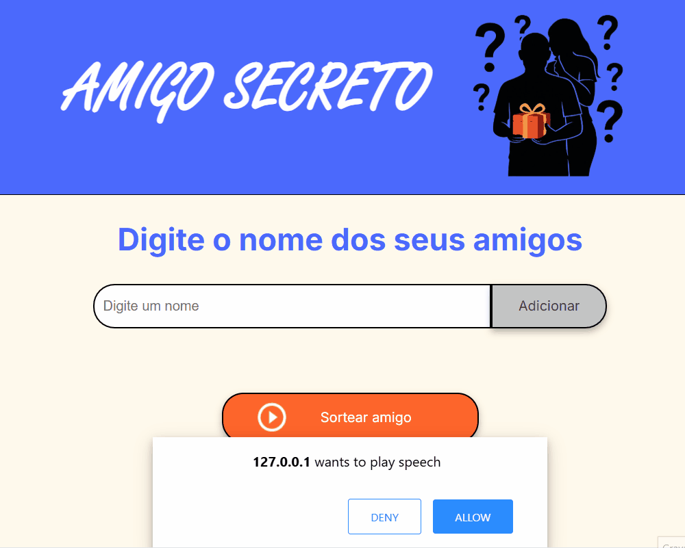

# 🎁 Amigo Secreto

Um jogo simples e interativo para sortear um amigo secreto, desenvolvido com HTML, CSS e JavaScript.  
O projeto inclui narração de voz usando a API ResponsiveVoice e validação para permitir apenas nomes com letras e acentos.

---

## 📌 Funcionalidades

- ✅ Adicionar nomes à lista de participantes.

- ✅ Validação para impedir:  
  - Campos vazios.  
  - Números ou caracteres especiais.

- ✅ Sorteio aleatório de um amigo secreto.

- ✅ Narração por voz das mensagens usando ResponsiveVoice.

- ✅ Interface responsiva e estilizada.

---

## 🖼️ Demonstração

---

## 🚀 Como usar

### 1. Clone este repositório:

   git clone https://github.com/seuusuario/amigo-secreto.git

### 2. Acesse a pasta do projeto

    cd amigo-secreto

### 3. Abra o arquivo *index.html* no seu navegador.

## 📂 Estrutura de arquivos

📁 amigo-secreto 
│-- index.html        # Estrutura HTML do jogo 
│-- style.css         # Estilos visuais 
│-- app.js            # Lógica do sorteio e narração 
│-- assets/           # Imagens e ícones usados 

## ⚙️ Tecnologias utilizadas
- HTML5
- CSS3
- JavaScript (ES6+)
- ResponsiveVoice API (para narração)

## 🎯 Lógica do funcionamento

### Entrada de dados

- Usuário digita um nome no campo de texto.
- Validação impede campos vazios ou nomes com números/símbolos.

### Lista de participantes

- Cada nome válido é adicionado a um array e exibido na tela.

### Sorteio

- Ao clicar em “Sortear amigo”, o sistema escolhe aleatoriamente um nome da lista.
- O resultado é exibido e narrado em voz alta.

## 📢 Observações importantes

- A narrativa de voz depende de conexão com a internet para acessar o serviço ResponsiveVoice.
- O projeto não salva os nomes após atualizar a página (sem persistência local).

## 📜 Licença
### **Este projeto é de uso livre para fins educacionais.**